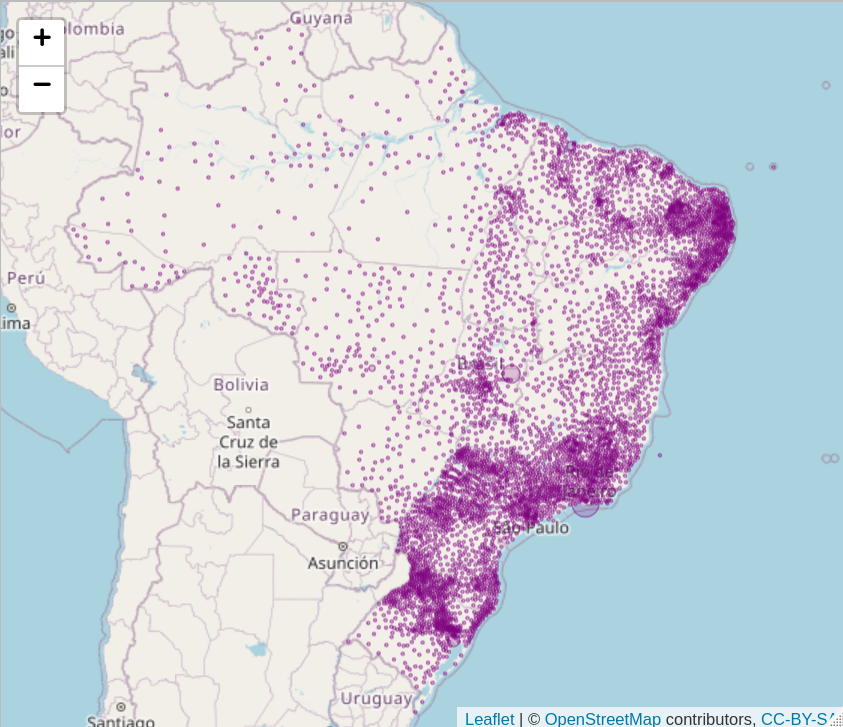

<!-- README.md is generated from README.Rmd. Please edit that file -->

```{r, include = FALSE}
knitr::opts_chunk$set(
  collapse = TRUE,
  comment = "#>",
  fig.path = "man/figures/README-",
  out.width = "100%"
)
```

# vacinr

<!-- badges: start -->
<!-- badges: end -->

O pacote `{vacinr}` foi criado durante uma live da Curso-R para visualizar dados de vacinação da Covid-19.

Os dados vieram do [Brasil.IO](https://twitter.com/brasil_io/status/1361080270791864321), que por sua vez vieram do [Open DataSUS](https://opendatasus.saude.gov.br/dataset/covid-19-vacinacao).

## Instalação

``` r
# install.packages("devtools")
devtools::install_github("curso-r/vacinr")
```
## Exemplo

Um exemplo de funcionalidade:

```{r example, eval=FALSE}
library(vacinr)
mapa(da_vacinacao_municipio, "n")
```



## Aplicativo

https://rseis.shinyapps.io/vacinr
